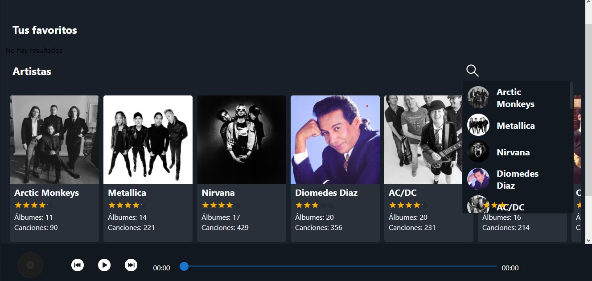
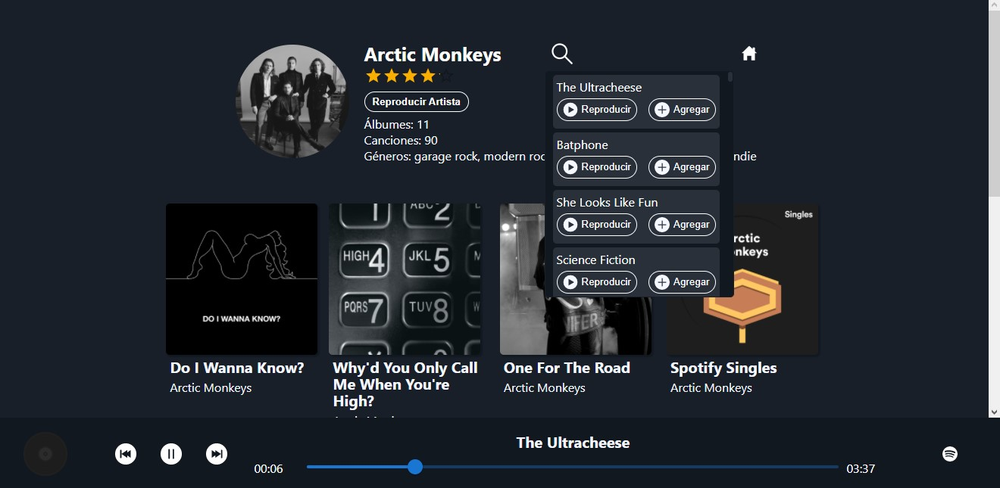
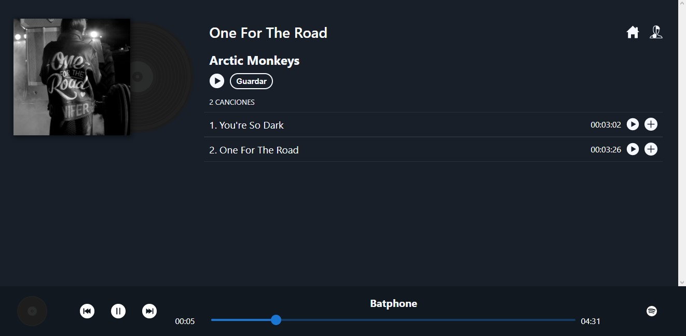

<h1 align="center"> 
    
  <br>
    <a href="https://musicfy.onrender.com" >Musicfy</a>
  <br>
</h1>
<p align="center"> 🎵 Listen your music! 🔊 <p>

---

## 🚀 Getting Started 
### 🟠 Pre-requirements
* yarn
* node

### 🟠 Installation
1. Clone this repo.
2. Install dependencies: `yarn`
3. Create production build: `yarn build`
4. Start the production server: `yarn start`

## 🔃 Scripts
### 🔦 Run dev server
This project uses next js. To work on the development of new features run the develop server:
```bash
yarn dev
```

## 🖥 Technologies
* React
* TypeScript
* Next js

## 👥 Authors
* 👩🏽‍💻  [Luis Felipe Forero](http://github.com/luisforerop)

## 📖 Lincense
The (MIT) Lincense

## 📷 Some captures
### Home page

### Artist page

### Album page
